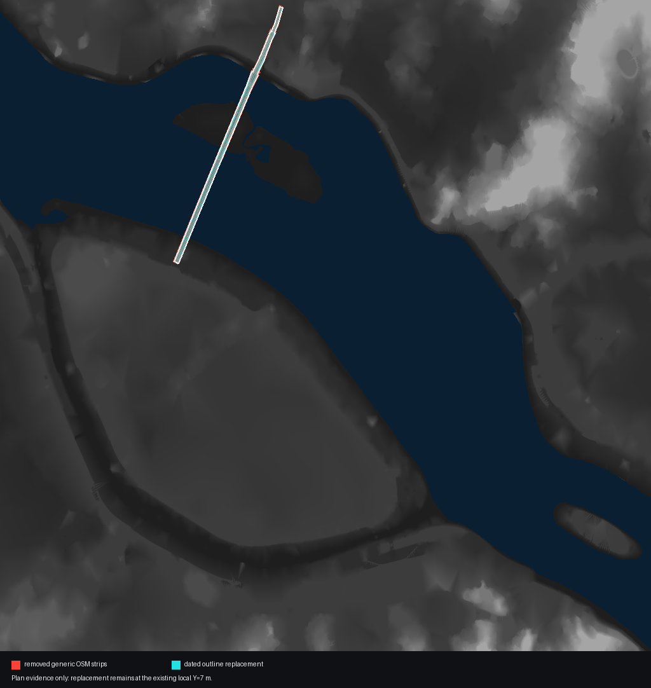
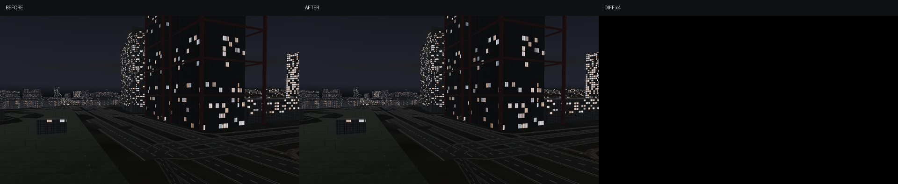

# V1-7 서강대교 역사 평면 의미 복원

이번 단계는 배포 장면이 서강대교의 외곽선, 차도, 보도를 각각 독립 교량으로
해석해 같은 위치에 겹쳐 그리던 오류를 제거한다. 2024-10-05 19:20 KST 역사
OSM way ID 7개를 고정하고, 폐합된 `man_made=bridge` 외곽선의 양 변을 65개
횡단면으로 재표본화해 하나의 연결된 상판으로 렌더한다.

## 증거와 적용 경계

- 역사 평면: OSM way `875036744` 외곽선과 차도·보도 way 6개
- 안전 게이트: 기존 상판 최소 80세그먼트가 정합될 때만 대체 자산 적용
- 제거: 외곽선 내부 또는 경계 8m 이내의 기존 일반 상판 90세그먼트
- 대체: 연결된 단일 상판 64세그먼트
- 정점: 6,330 → 6,174개, 프레임 중 추가 연산 없음
- 누적 평면 면적: 119,112.65 → 58,036.61㎡
- 수직 좌표: 입력과 출력 모두 `Y=7m`; V1-6 수직 게이트는 계속 차단

외곽선 중심선은 1,766.024m다. 공개된 본교 1,320m와 북단 접속교 386m의 합보다
60.024m 길어, 이를 완공도면 station으로 정규화할 수 없다. 따라서 공식
`EL 23.3m` 항로부 상판 하부고를 상면 프로필이나 특정 OSM 정점에 적용하지 않았다.

서울시 도장공사 기간은 2024-02-28~2025-11-27로 행사일을 포함하지만, 행사일의
공정 위치·비계 배치·도장 경계는 공개 자료에서 확인하지 못했다. 임의의 비계나
새 도장 구간은 그리지 않는다.

## 검증

고정 교량 시점 A/B는 HDR·SDR 모두 0픽셀 변화다. 보이는 최상단 실루엣을 유지하고
겹친 스트립만 제거한 결과이며 외관 개선을 주장하는 자료가 아니다. 평면 지도에서
제거 대상과 단일 대체 상판의 범위를 별도로 확인했다.

360프레임 독립 프로세스 3회에서 현재 frame p95는
21.202/23.620/21.424ms로 모두 16.67ms를 넘었다. 부모는
14.873/19.451/20.472ms로 1회만 통과했다. 순차 실행 중 시각·물리 시간이 함께
상승했으므로 이번 초기화 전용 메시 축소가 성능 저하의 원인이라고 단정하지 않지만,
엄격한 노트북 60FPS 게이트는 실패다.

의미 자산·중복 선택·연결성·다른 장면 오적용 거부 집중 테스트 6개와 전체 회귀
테스트 570개가 통과했다.

```powershell
python -m tools.import_seogang_bridge_semantics
python -m tools.measure_bridge_plan_semantics
python -m pytest tests/test_bridge_semantics.py -q
```




