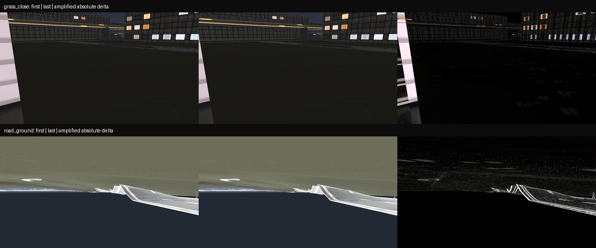

# V2-1a metric material and motion baseline

This stage measures the current ground-material sampling contract before any
appearance tuning. It does not claim that the generic CC0 scans match Yeouido.

The audit locks four kinds of evidence:

1. the physical tile width and millimetres per texel of every 1K scan;
2. opposite-edge discontinuity relative to ordinary neighbouring pixels;
3. the ground-plane pixel footprint from 2 to 80 m for the shipped 24 mm,
   1280×720 camera; and
4. eight-frame linear-HDR camera-right motion sequences at the canonical
   `grass_close` and `road_ground` views.

The motion metric is a reproducible baseline, not a visual-quality pass. It
includes geometry and perspective motion, and no registered real sequence yet
defines how much high-frequency frame delta is acceptable. The audit therefore
keeps site colour tuning and a temporal shimmer pass/fail gate disabled.

The current shader uses world-metric UVs, mipmaps, and trilinear minification.
The texture array does not explicitly configure anisotropic filtering. At the
80 m sample the horizontal-ground pixel footprint is more than 20:1
anisotropic, while the source tile repeats roughly 19.5–41.1 times across the
2–80 m inspection span. Those are the next filtering and anti-tiling targets.



Rebuild the report and diagnostic with:

```powershell
python -m tools.audit_material_detail
python -m pytest tests/test_material_detail.py -q
```
