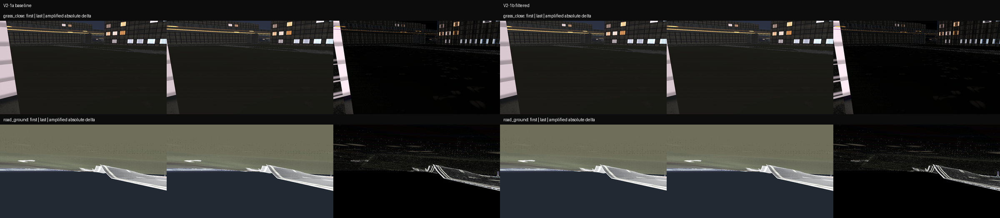

# V2-1b 재질 필터링·안티타일링 A/B

이 단계는 V2-1a의 고정된 선형 HDR 이동 캡처에 다음 두 변경을 적용한 공학 A/B다.

- 스캔 텍스처 배열에 명시적인 8× 이방성 필터를 요청하고 실제 적용값을 기록한다.
- 원본 타일의 미터 스케일을 유지하면서 최대 0.16m 저주파 좌표 변형과 비주기적
  매크로 명도·거칠기 변화를 적용한다.

좌표 변형의 자코비안으로 계산한 국소 스케일 변화 상한은 1.136%다. 색 범위는
기존 스캔의 상대 명도를 기준으로 ±6%, 거칠기 오프셋은 ±0.0275로 제한했다.
여의도 현장 표본을 사용한 색·거칠기 보정은 수행하지 않았다.

## 동일 조건 이동 비교

두 경로 모두 24mm, 1280×720, 프레임당 카메라 오른쪽 0.02m 이동, 시점당 선형 HDR
8프레임이다.

| 시점 | 평균 델타 비 | p95 델타 비 | 신호 정규화 델타 비 | 고주파 델타 비 |
|---|---:|---:|---:|---:|
| `grass_close` | 1.000 | 1.000 | 1.000 | 1.000 |
| `road_ground` | 1.090 | 2.012 | 1.086 | 1.029 |

`road_ground`의 보존된 표면 대비 때문에 이동 델타는 증가했고, 고주파 델타 비중도
2.9% 증가했다. 실제 등록 이동 영상의 허용 임계값이 없으므로 이 결과를 반짝임 개선
또는 품질 통과로 해석하지 않는다. 이번 산출물은 명시적 필터 적용, 스케일 보존과
동일 조건 A/B 재현까지만 확정한다.

1280×720, 3D 유체, GPU 완료 대기 조건의 360프레임 통합 측정은 frame p95
16.250ms, visual p95 12.297ms, physics p95 5.484ms다. 단일 실행이므로 V9의
3회 반복 완료 게이트를 대신하지 않는다.



재생성 및 검증:

```powershell
python -m tools.audit_material_filtering
python -m pytest tests/test_material_filtering.py -q
```
