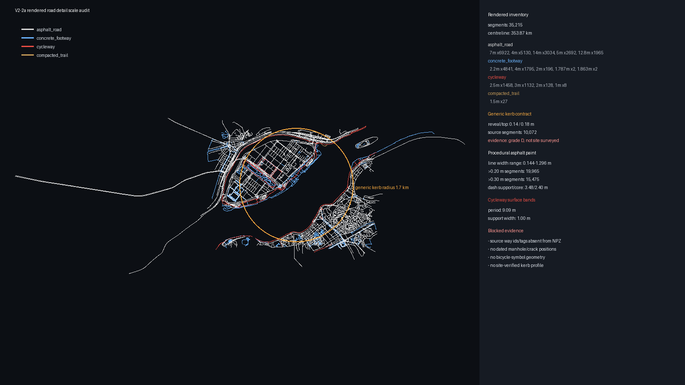

# V2-2a 경계석·도로 표식 실척 감사

현재 렌더 경로의 경계석, 아스팔트 차선, 자전거도로 표식과 누락된 노면 세부를
미터 단위로 역산한 감사다. 이 단계는 새 경계석·맨홀·균열을 배치하지 않는다.

## 렌더 인벤토리

터널 가시성 필터를 거친 장면에는 35,215개 선형 구간과 약 353.87km의 누적
중심선이 있다.

| 표면 | 구간 수 | 중심선 길이 | 폭 p50 | 폭 범위 |
|---|---:|---:|---:|---:|
| 아스팔트 | 25,616 | 262.96km | 7.00m | 3.20~28.80m |
| 콘크리트 보행로 | 6,846 | 63.27km | 2.20m | 1.79~4.00m |
| 자전거도로 | 2,726 | 27.39km | 2.50m | 1.00~3.00m |
| 비포장 산책로 | 27 | 0.25km | 1.50m | 1.50m |



## 판정

- 경계석은 아스팔트 가장자리 10,072구간에서 높이 0.14m, 상단 폭 0.18m로
  생성된다. 두 치수와 1.7km 적용 반경은 여의도 실측이 아닌 D등급 일반값이다.
- 아스팔트 표식 폭은 정규화 도로 폭에 비례해 0.144~1.296m로 변한다. 0.20m를
  넘는 구간이 19,965개이고 0.30m를 넘는 구간이 15,475개이므로 미터 단위
  표식 계약으로 볼 수 없다.
- 점선은 6m 주기에 3.48m 전이 포함 지지 길이, 2.40m 코어 길이를 사용한다.
  차로 수·도로 등급·중앙선 종류와 연결되지 않는다.
- 자전거도로는 9.09m마다 폭 1.00m의 횡방향 밴드를 그릴 뿐, 자전거 기호나
  현장 표식 위치 형상이 없다.
- 원본 도로의 OSM way ID와 태그는 `yeouido_scene.npz`에 남아 있지 않다.
  별도 상세 스냅샷 131개 요소에는 도로·맨홀·자전거 표식 요소가 0개다.

따라서 현재는 경계석 치수의 현장 검증, 미터 표식 폭, 맨홀·균열·자전거 기호
배치를 모두 차단한다. 다음 단계는 행사 시점의 도로 원본을 별도 체크섬 자산으로
보존하고 way ID·태그·중심선을 렌더 구간과 결속하는 V2-2b 의미 계약이다.

재생성 및 검증:

```powershell
python -m tools.audit_road_details
python -m pytest tests/test_road_details.py -q
```
