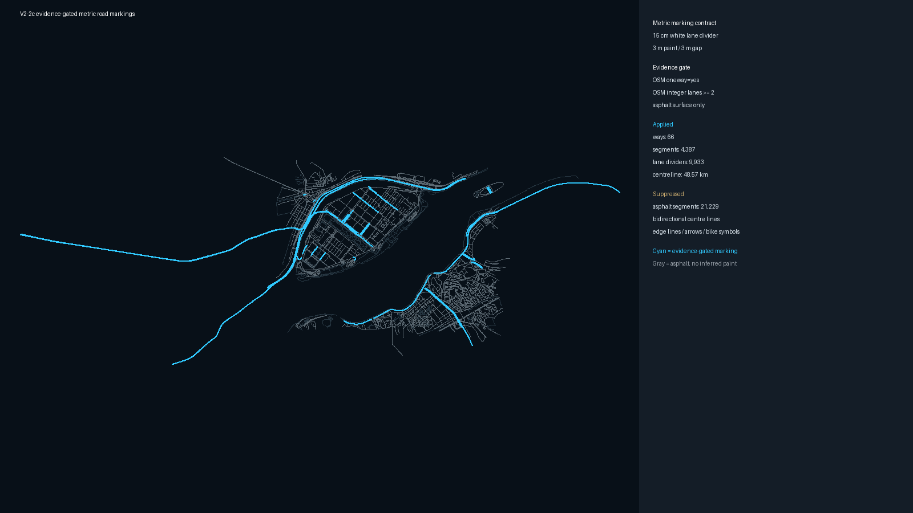
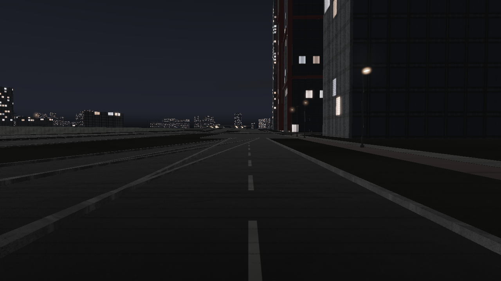

# V2-2c 근거 기반 미터 도로 표식

2024-10-05 10:20 UTC OSM way 결속을 런타임 도로 메시와 연결하고, 근거가 충분한
동일 방향 내부 차로 경계만 미터 단위로 렌더링한다. 모든 아스팔트에 임의로 그리던
가장자리선·중앙선과 자전거도로의 주기적 횡단 띠는 제거했다.

## 적용 계약

- OSM `oneway=yes`
- 정수형 OSM `lanes`가 2 이상
- 아스팔트 surface code
- 단일 OSM way에 고유 결속된 렌더 구간

이 조건을 만족하는 66 way, 4,387구간, 중심선 48.57km에 내부 차로 경계
9,933개를 적용한다. 아스팔트 21,229구간은 근거가 부족하므로 무표식으로 유지한다.
양방향 중앙선의 색·실선/점선 유형, 가장자리선, 회전 화살표와 자전거 기호는
역사 시점 배치 근거가 없어 계속 차단한다.

차선 폭은 행사 직전 시행된 도로교통법 시행규칙 별표 6의 15~20cm 범위와 국토교통부
차선도색 유지·관리 매뉴얼의 도시부 표준을 근거로 하한인 15cm를 사용한다. 점선은
도색 3m·빈 구간 3m다. 이 값은 법정·표준 치수이지 여의도 현장 도색의 실측값은 아니다.

- [도로교통법 시행규칙 별표 6(2024-09-20)](https://law.go.kr/LSW/flDownload.do?bylClsCd=110201&flSeq=144234901)
- [국토교통부 차선도색 유지·관리 매뉴얼(2024)](https://www.molit.go.kr/portal/common/download/DownloadMltm2.jsp?FileName=%EC%B0%A8%EC%84%A0%EB%8F%84%EC%83%89+%EC%9C%A0%EC%A7%80%C2%B7%EA%B4%80%EB%A6%AC+%EB%A7%A4%EB%89%B4%EC%96%BC.pdf&FilePath=portal%2FDextUpload%2F202404%2F20240429_133733_839.pdf)





근접 화면은 명시적 2차로 일방통행 way를 따라 보는 공학 검증 카메라다. 역사 사진이나
실제 관람객 시점을 주장하지 않는다.

## 성능과 검증

1280×720, 3D GPU MAC 유체, GPU 완료 대기, 360프레임 단일 실행 결과는 frame p95
13.475ms, visual p95 10.696ms, physics p95 4.099ms다. 60 FPS 예산은 통과하지만
V9의 독립 3회 완료 게이트를 대신하지 않는다.

```powershell
python -m tools.build_road_detail_semantics
python -m tools.audit_metric_road_markings
python -m tools.capture_metric_road_marking
python -m pytest tests/test_road_detail_semantics.py tests/test_road_details.py -q
```
