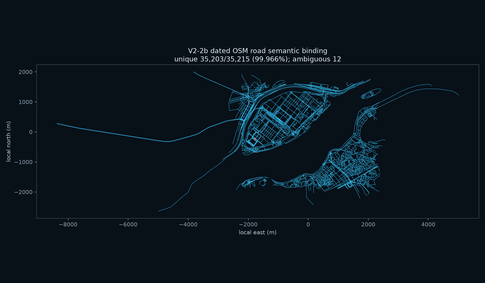

# V2-2b 행사 시점 도로 의미 결속

2024-10-05 10:20 UTC(19:20 KST)의 OSM `highway` way 2,421개를 별도 원본
스냅샷으로 보존하고, 현행 가시성 필터를 통과한 렌더 도로 35,215구간에 way ID와
선택 태그를 결속했다. 원본과 장면 파일은 SHA-256으로 잠근다.

## 결속 결과

| 항목 | 결과 |
|---|---:|
| 고유 결속 구간 | 35,203 / 35,215 (99.966%) |
| 중복 후보 구간 | 12 |
| 원본에 대응하지 않는 구간 | 0 |
| 렌더 가능한 원본 way | 2,263 |
| 교량 등 비도로 표면 way | 158 |
| 런타임에서 차폐되는 검증 터널 way | 8 |



비교 키는 중심선 양 끝점을 방향과 무관하게 정렬한 1cm 양자화 서명이다. 장면
자산은 터널 제외 정책 도입 전 생성됐으므로, 원본 재구성은 당시 포함 정책을
재현한 뒤 현재의 검증된 8개 터널 차폐 필터를 적용한다. 남은 12구간은 같은
중심선을 공유하는 보행자 way 5개가 원인이다. 어느 하나를 추정 선택하지 않는다.

## 태그 증거 범위

- 명시 폭 `width`: 52 way
- 차로 수 `lanes`: 189 way
- 표면 `surface`: 437 way
- `cycleway:right`: 52 way, `bicycle`: 162 way
- `turn:lanes`: 0 way

따라서 이 단계는 의미 결속만 완료한다. 렌더 표식은 아직 바꾸지 않으며,
V2-2c는 결속된 구간 중 원본 태그가 실제로 뒷받침하는 항목만 미터 단위로
적용해야 한다. 태그가 없는 차선, 회전 화살표, 자전거 기호는 생성하지 않는다.

## 재생성과 검증

```powershell
python -m tools.import_osm_scene --roads-only
python -m tools.build_road_detail_semantics
python -m pytest tests/test_road_detail_semantics.py -q
```
