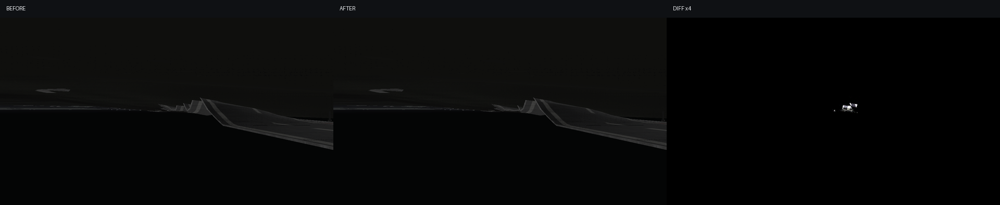
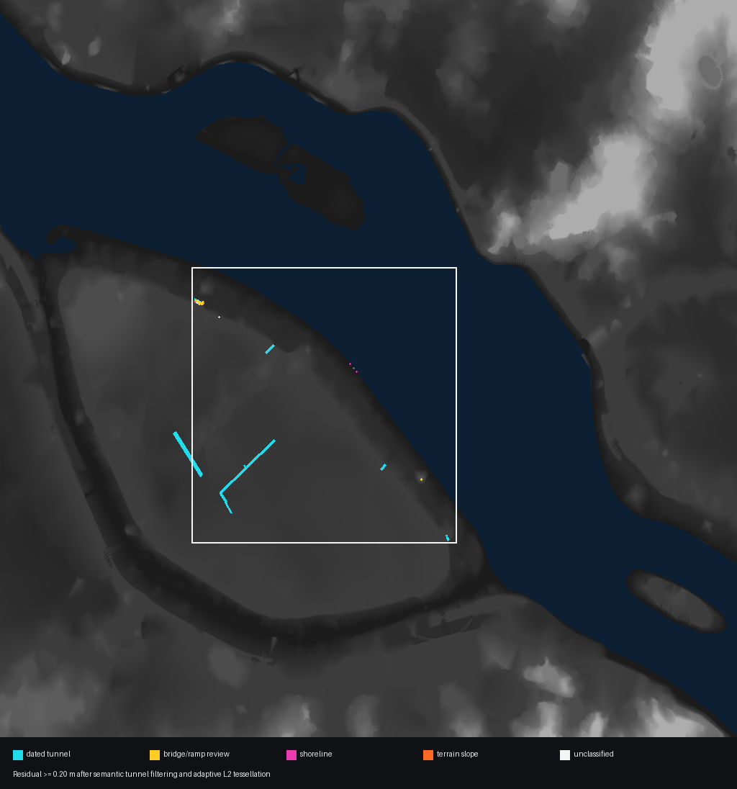

# V1-5 지하 도로 의미 분리 검증

이 단계는 도로를 지형 높이장에 더 강하게 붙이는 작업이 아니다. 2024-10-05
10:20 UTC 역사 OSM에서 `tunnel=yes`로 기록된 AOI 도로 8개가 기존 정적 자산에서
지표면 도로처럼 그려지는 오류를 먼저 제거한다.

## 구현 계약

- 증거 자산: `assets/road_structure_semantics_2024-10-05.json`
- 일치 조건: 중심선 거리 0.25m 이하, 진행 방향 코사인 절댓값 0.98 이상
- 정책: 일치하는 터널 노면은 지형·반사 렌더 배치에서 제외
- 안전 조건: 같은 위치를 가로지르는 방향이 다른 지상 도로는 유지
- 신규 장면 생성: `tunnel=yes`, `tunnel=building_passage`, `covered=yes` 도로를
  처음부터 지형 추종 노면으로 만들지 않음

이 정책은 터널의 존재와 비가시성만 사용한다. 터널 깊이, 포털 치수, 램프 표고,
옹벽 단면은 자료에 없으므로 생성하지 않았다.

## 정량 결과

- 터널 8개 모두 정합, 가짜 지표 노면 125세그먼트 제거
- 적응형 일반 도로: 76,236 → 75,731삼각형
- AOI 20cm 이상 접촉 표본: 256 → 185
- AOI 50cm 이상 접촉 표본: 35 → 32
- AOI 접촉 p99: 0.11351 → 0.09409m
- 고정 시점 SDR 변화: 1,834/921,600화소, 0.1990%

표본 수는 삼각형 제거와 세분화에 따라 변하므로 실제 면적 감소량으로 해석하면 안
된다. 남은 185개 중 157개는 교량 중심선 35m 이내다. 이들은 오류 가능성이 높지만
실제 표고 자료 없이 평탄화하거나 들어 올리지 않는다.

## 성능 판정

부모 커밋과 현재 구현을 번갈아 독립 프로세스로 360프레임씩 3회 측정했다. 현재
frame p95는 14.844/19.830/15.075ms로 2회만 16.67ms 미만이었다. 필터는 장면
초기화에서 한 번 수행되고 정점 수도 줄지만, 한 회에서 시각·물리 시간이 함께 커진
이상치가 발생했으므로 엄격한 60 FPS 게이트는 실패다. 이 자료로 성능 향상을
인과적으로 주장하지 않는다.

## 산출물

- `road_structure_report.json`: 정책, 접촉 오차, 잔류 분류, 성능 원자료
- `road_structure_map.png`: 터널 중심선과 잔류 오차 분류 지도
- `road_tunnel_ab.png`: 같은 카메라의 이전/현재/4배 차이 화면

중점 회귀 41개와 전체 회귀 555개가 통과했다.

