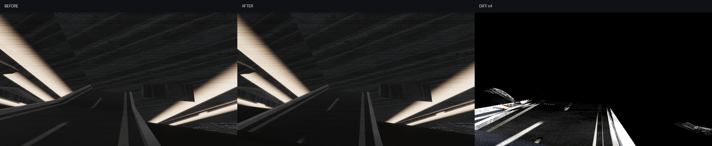

# V1-4 적응형 도로 지형 추종

행사장 북측 AOI 안에서 현재 도로 삼각형의 중심·변 중점이 지형 접촉 목표에서
5cm 이상 벗어날 때만 해당 삼각형을 변 중점으로 나눈다. 자식 삼각형도 같은 검사를
반복하되 최대 L2에서 중단한다. 계단, AOI 밖 형상과 수면 위 표본은 세분하지 않으며,
도로 상판과 경계석을 함께 처리해 서로 다른 곡면이 생기지 않게 한다.

## 형상 변화

- 일반 도로: 70,464 → 76,236삼각형, L0/L1 세분 부모 1,001/923개
- 도로 경계석: 81,024 → 86,553삼각형, L0/L1 세분 부모 858/985개
- 도로·경계석·계단 합계: 455,112 → 489,015정점
- 총 정점 배수: 1.0745×; 전역 균일 L2의 16×를 적용하지 않음

일반 도로의 AOI 표본에서 최대 접촉 편차는 2.043m에서 1.172m, p99는
0.177m에서 0.114m로 감소했다. 50cm 이상 표본은 125개에서 35개로 줄었다.
테셀레이션 뒤에는 표본 밀도가 증가하므로 개수와 비율만으로 면적 개선율을 주장하지
않고, V1-3의 고정 균일 반사실험과 최대·p99를 함께 판정한다.

## 화면 검증

기존 `road_ground` 카메라는 수정 구간을 보지 않아 화면이 비트 단위로 같았다.
이를 최대 AOI 도로 편차를 직접 보는 보행 높이 카메라로 교체하고 카메라 정의 파일의
SHA-256을 캡처 manifest에 추가했다. 새 A/B 시점에서는 921,600화소 중 209,793화소
(22.7640%)가 바뀌었으며, 상판·차선·경계석이 같은 세분 곡면을 따른다.

이 화면은 접촉 형상 개선을 검증하지만 도로 구조 자체가 실측되었다는 뜻은 아니다.
다층 램프와 교량 분류, 난간 형상과 재질은 여전히 사진·도면 증거 대조가 필요하다.

## 360프레임 성능 A/B

부모 커밋 `1260977`과 현재 코드를 별도 프로세스로 번갈아 실행했다. 조건은
1280×720, 3D 유체, 120Hz 물리, 이동 카메라, GPU 완료 대기이며 각 360프레임이다.

| 실행 | 부모 frame p95 | 현재 frame p95 | 현재 visual p95 | 현재 physics p95 |
|---:|---:|---:|---:|---:|
| 1 | 16.975ms | 16.910ms | 11.860ms | 5.696ms |
| 2 | 17.452ms | 17.290ms | 12.121ms | 5.913ms |
| 3 | 17.084ms | 16.991ms | 11.954ms | 5.997ms |

세 쌍 모두 메시로 인한 p95 악화는 관측되지 않았다. 그러나 현재 세 실행 역시 모두
16.67ms 미만 조건을 만족하지 못하므로 안정적 60FPS 게이트는 **실패** 상태다.
최악 frame p95는 17.290ms이며 V9 성능 최적화가 계속 필요하다.

정량 원본은 `adaptive_road_report.json`에 저장되어 있다.
